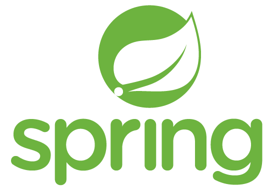
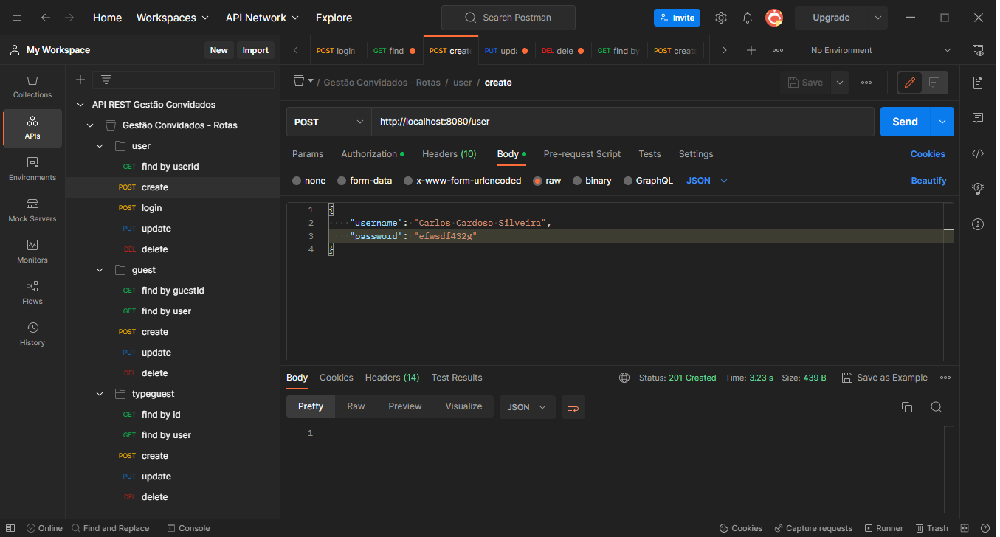
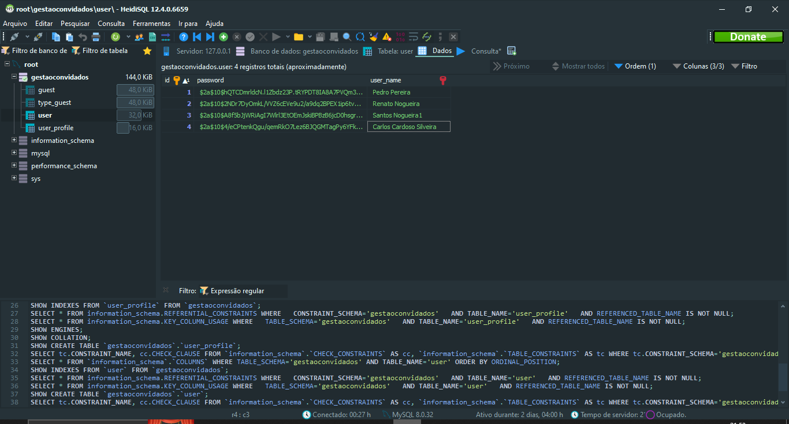
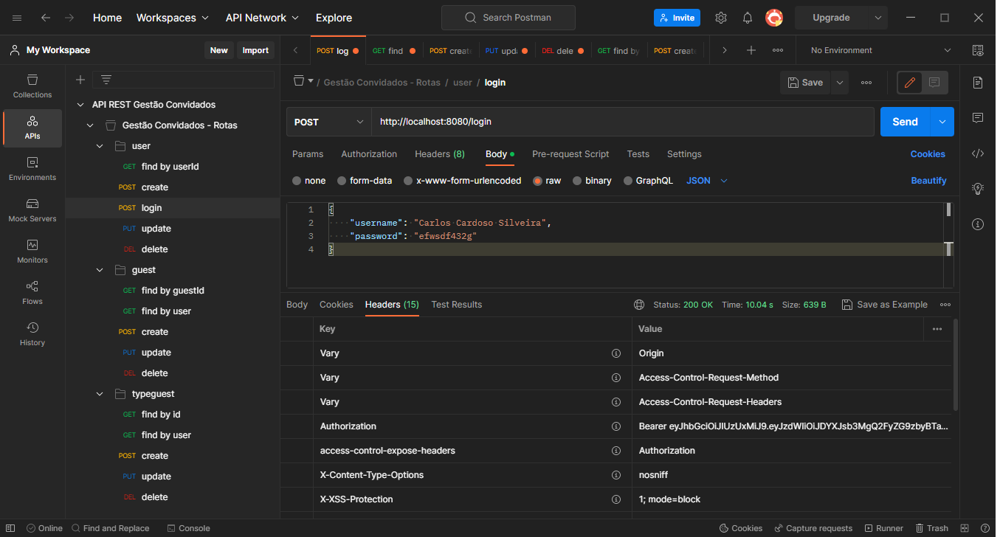
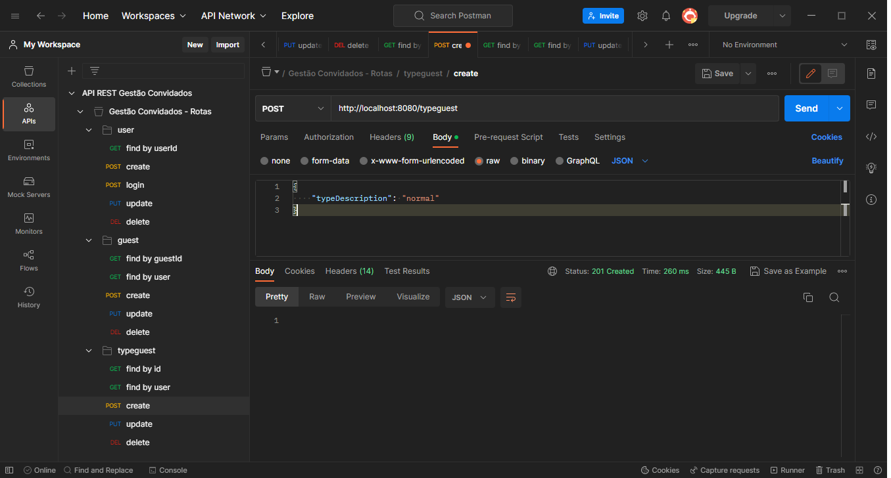
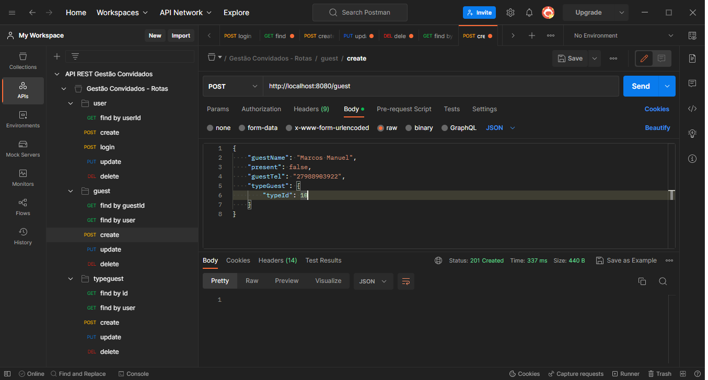

<h1 align="center"> API Restful - Sistema de gestão de convidados </h1>

  

 Projeto desenvolvido com Spring Boot, MySql e PostMan.
 

  <a href="#-sobre-o-projeto">Sobre o projeto</a>&nbsp;&nbsp;&nbsp;|&nbsp;&nbsp;&nbsp; 
  <a href="#-layouts">Layouts</a>&nbsp;&nbsp;&nbsp;|&nbsp;&nbsp;&nbsp;
  <a href="#-requisitos-e-recomendações">Requisitos e recomendações</a>&nbsp;&nbsp;&nbsp;&nbsp;&nbsp;&nbsp;

</img>

# 💻 Sobre o projeto 

A API consiste em um sistema de controle e gerenciamento de convidados. O objetivo do projeto é construir uma API Restful completa com sistema de autentificação e autorização via token. O sistema permite o registro de novo usuário e o login nas rotas públicas. Depois de logado, o usuário pode registrar tipos de convidados para um maior controle de privilégios (por exemplo: vip, comum, etc) e realizar o gerenciamento de convidados (inserção, remoção, etc). 

OBS: O sistema possui dois tipos de usuário, administrador e comum. O usuário comum só pode resgatar e alterar seus dados enquanto o administrador tem acesso a todos os dados salvos no banco de dados.

  

# 📸 Layouts 

<h3 align="center">Cadastro de novo usuário</h3>

</img>

 
<h3 align="center">Senha criptografada no banco</h3>

</img>

 
<h3 align="center">Realização de login do novo usuário cadastrado</h3>

</img>
 
 
<h3 align="center">Utilizando a chave gerada na autentificação para a criação de um novo tipo de convidado</h3>

</img>
 
 
<h3 align="center">Registro de um novo convidado</h3>

</img>

  

# 📝 Requisitos e recomendações

REQUISITOS:
- Java 11 ou superior.

RECOMENDAÇÂO: 
- Java 17.

  

# ✒️ Autor

Yves Lima Silva

<a href="https://www.linkedin.com/in/yves-lima-b63b2515b/"> Linkedin </a>
